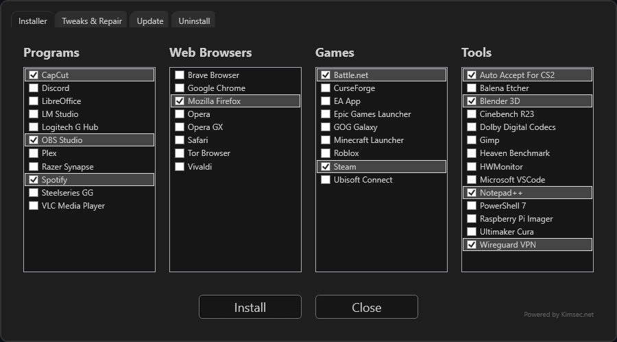
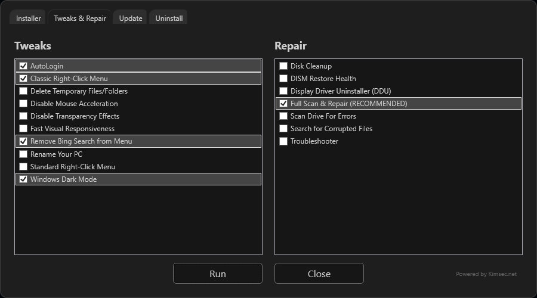
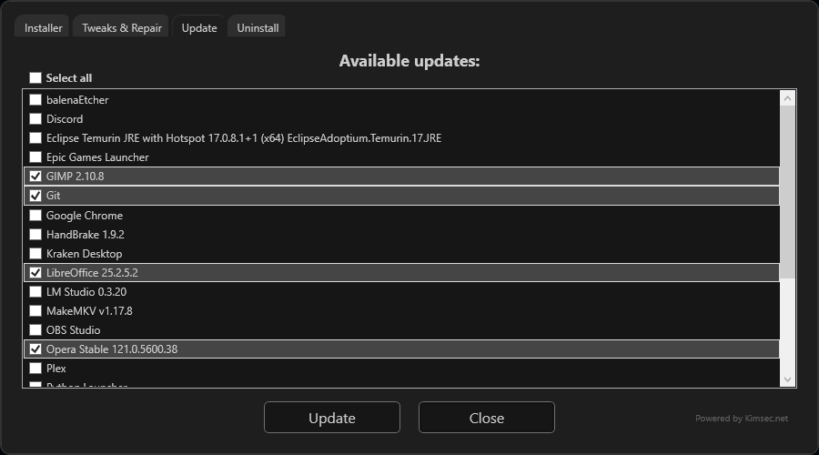
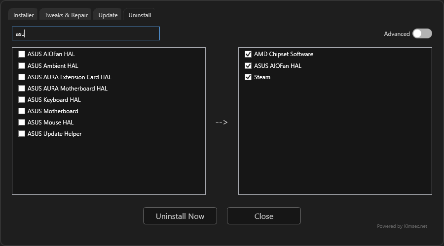

<p align="center" width="10%">
    </a>
</p>

# <p align="center">EZ-Apps</p>

<br><p align="center" width="100%">
<a href="https://www.buymeacoffee.com/kimsec">
  </a></p>
<p align="center">
  <a href="https://github.com/kimsec/EZ-Apps/releases/latest">
    </a>
    <a href="https://github.com/Kimsec/EZ-Apps/releases">
    </a>
</p>


## Description
**EZ-Apps** is a PowerShell-based utility script designed to simplify the installation of popular applications, system tweaks, repair tasks, updating and uninstalling software easy and user-friendly.

## Features

- **Install Popular Software**: Easily install browsers, games, utilities, and more with one click.
- **Tweaks & Repairs**: Apply useful Windows tweaks (e.g., dark mode, disable Bing search, classic right-click menu) and run repair tools (SFC, DISM, chkdsk, etc.).
- **Update Applications**: See available updates for installed programs and update them directly from the GUI.
- **Uninstall Applications**: Search, select, and uninstall programs using winget, registry, or Appx methods. Advanced mode lets you see system and Microsoft apps.
- **Modern GUI**: Clean, dark-themed interface built with WPF/XAML via PowerShell.

## How to Use

1. **Run the Script**  
   Open **PowerShell** and execute the following command:
   ```powershell
   iwr -useb kimsec.net/apps | iex
2. **Select Actions**  
   - Select the tab for Install, Tweaks & Repair, Update, or Uninstall.

3. **Execute**  
   - Click the `Install` or `Run` button to start the process.

4. **Enjoy**  
   - The script will handle the rest, including downloading, installing, and applying tweaks.
## Screenshots





## Requirements

- Windows 10 or newer.
- PowerShell 5.1 or higher.
- [Winget](https://learn.microsoft.com/en-us/windows/package-manager/) (Windows Package Manager) must be installed.
- Administrator privileges for installing/uninstalling system software


## Customization

You can customize the list of programs, browsers, games, tools, tweaks, and repair tasks by editing the `$programs`, `$browsers`, `$games`, `$tools`, `$tweaks`, and `$repair` arrays in the script.

## Example Tweaks
- **Make Windows ready RPC Shutdown** 
- **Remove Bing Search from Start Menu**
- **Enable Windows Dark Mode**
- **Disable Transparency Effects**
- **Classic Right-Click Menu**
- **Fast Visual Responsiveness**
- **Disable Mouse Acceleration**

## Example Repair Tasks

- **Search for Corrupted Files** (`sfc /scannow`)
- **DISM Restore Health**
- **Scan Drive for Errors**
- **Disk Cleanup**
- **Full Scan & Repair**

## Ideas

- **More and better program catagories**
- **Make this appear after windows install** 

## Disclaimer

This script is provided "as is" without any warranty. Use it at your own risk. The author is not responsible for any damage caused by using this script.

## License

This project is licensed under the MIT License. See the [LICENSE](LICENSE) file for details.

---

**Powered by Kimsec.net**
